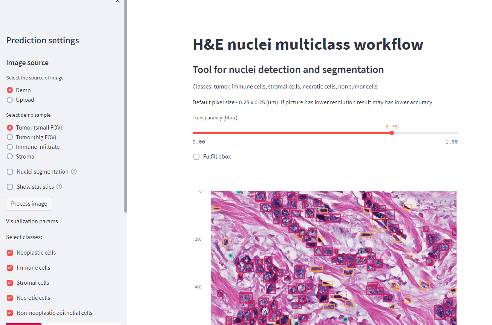

MultiNucSeg is a multiclass nuclei detection and segmentation pipeline for H&E images. 
This repository includes a streamlit web service. Inference is based on the ONNX format. 
For correct work, it requires two models:
* Multiclass nuclei detection 
* Nuclei segmentation

Segmentation module works with mosaic bboxes, i.e. input image includes nuclei crops from the detection module.
Interface example:

<div align="center">
  
</div>
<br>

## How to run

Default models:
```
streamlit run main.py 
```
Custom models:
```
streamlit run main.py -- --detection_model 'model_path' --segmentation_model 'model_path'
```

## Models will be published later
